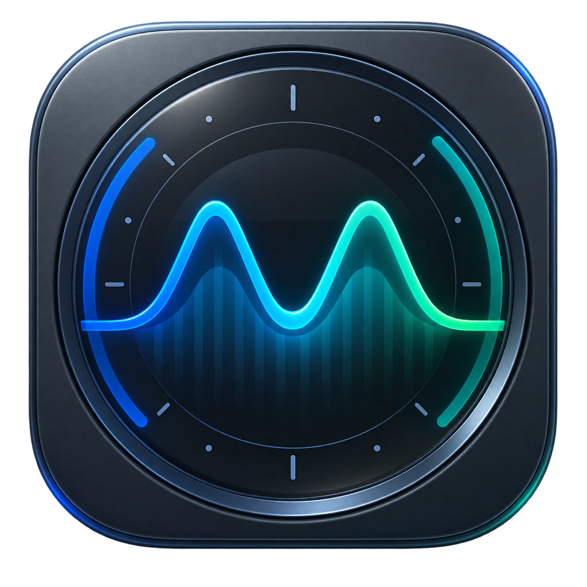
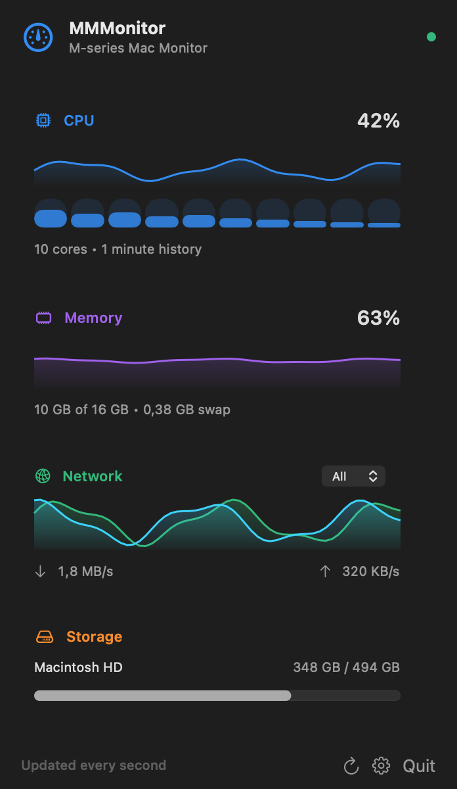
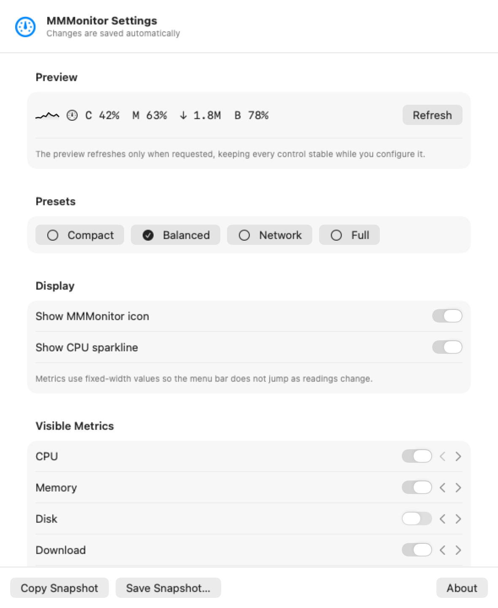

<p align="center">
  
</p>

# MMMonitor

**M-series Mac Monitor** — Apple Silicon performance at a glance.

MMMonitor is a lightweight, native, open-source menu-bar system monitor for Apple Silicon Macs. It is local-only: no accounts, analytics, network services, or persistent privileged helper. Administrator approval is requested only when you explicitly flush the DNS cache.

For deployment or security review, see [Architecture and IT Review](docs/ARCHITECTURE.md).

## Current features

- overall CPU usage with selectable 1-, 15-, or 60-minute history
- per-core CPU activity bars
- used and total memory with selectable live history
- swap usage
- current download and upload throughput
- selectable per-interface network throughput
- one-click DNS cache flushing from the Network card
- used and total capacity for mounted local volumes
- battery percentage, charging state, health, cycle count, design and full-charge capacity, and estimated remaining time
- top CPU processes with resident-memory use
- thermal state, system uptime, and load averages
- glanceable multi-metric menu-bar readout for CPU, memory, disk, network, battery, and thermal state
- compact, balanced, network, and full menu-bar presets
- reorderable menu-bar metrics with stable-width values and an optional app icon
- optional live CPU sparkline in the menu bar
- independent settings window that remains interactive while monitoring updates
- configurable one-, two-, or five-second sampling
- individually hideable dashboard modules
- rearrangeable dashboard modules
- compact and comfortable dashboard density
- launch at login using macOS Service Management
- user-triggered JSON diagnostic snapshot export
- optional sustained-threshold notifications with 15-minute cooldowns
- configurable notification quiet hours
- native light and dark mode
- VoiceOver-friendly metric summaries

## Screenshots

| Dashboard | Menu-bar configuration |
| --- | --- |
|  |  |

## Build and run

MMMonitor requires macOS 13 or later and Apple's Command Line Tools or Xcode.

```sh
cd ~/MMMonitor
./scripts/build-app.sh
open dist/MMMonitor.app
```

The release build is ad-hoc signed and targets `arm64`. GitHub releases provide the same `.app` inside a downloadable archive. Users may need to approve locally downloaded, non-notarized applications according to their macOS or workplace security policy.

## Install from a GitHub release

1. Download the arm64 zip and matching `.sha256` file.
2. Verify the checksum using the command in [Release preparation](#release-preparation).
3. Unzip it and move `MMMonitor.app` to `/Applications`.
4. Control-click the app and choose **Open** the first time if macOS offers that option.

Managed Macs may require IT approval for an ad-hoc-signed or non-notarized app. MMMonitor's local-only design and fixed DNS maintenance command are straightforward for an administrator to inspect. DNS flushing asks for administrator approval through the normal macOS dialog; monitoring itself remains unprivileged. Do not bypass an organization’s security policy.

Click the gear in the dashboard to open the independent settings window. Its Menu Bar tab controls the visible metrics, their left-to-right order, presets, icon, and CPU sparkline. Settings can also be opened with <kbd>⌘</kbd><kbd>,</kbd> while MMMonitor is active.

| Indicator | Meaning |
| --- | --- |
| `C` | CPU use |
| `M` | memory use |
| `D` | startup disk use |
| `↓` / `↑` | download / upload per second |
| `B` / `B+` | battery level / charging |
| `T` | thermal state |

## Development

```sh
swift build
swift run MMMonitor
```

Use `swift run MMMonitor --open-settings` to launch directly into the standalone settings window during development.

Generate privacy-safe release screenshots from the real SwiftUI views with:

```sh
swift run MMMonitor --export-screenshots docs/images
```

Regenerate `AppIcon.icns` after changing the 1024 px source artwork with:

```sh
swift scripts/build-icon.swift Resources/AppIcon.png Resources/AppIcon.icns
```

See [ROADMAP.md](ROADMAP.md) for planned work.
Contributions are welcome; see [CONTRIBUTING.md](CONTRIBUTING.md) and [SECURITY.md](SECURITY.md) before sharing system diagnostics.

## Release preparation

Create a versioned zip and checksum locally with:

```sh
./scripts/package-release.sh
```

The included GitHub Actions workflow performs the same release build and verification without publishing it. Release publication remains a deliberate manual step.

To verify a downloaded release, place the zip beside its `.sha256` file and run:

```sh
shasum -a 256 -c MMMonitor-0.3.1-arm64.zip.sha256
```

## Privacy

MMMonitor reads aggregate statistics from local macOS system APIs. It does not transmit monitoring data or persist it automatically. Snapshot files are written only when the user explicitly exports one. The network module reads interface byte counters to calculate throughput; it does not inspect network traffic or destinations. When you click Flush DNS, MMMonitor asks macOS to run the fixed `/usr/bin/dscacheutil -flushcache` and `/usr/bin/killall -HUP mDNSResponder` commands with administrator privileges. No user input is inserted into that command and no helper remains installed or running.

## License

MIT
